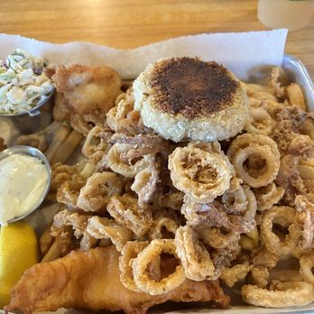

# Alex's Page! :joy:
> Yeah I spent 20 minutes trying to figure out how to quote- Alex

You should read this before continuing

## Table Of Contents
[My Coding Origin Story](my-programming-story)

[Hobbies/Interests](hobbies-interests)

## My Progamming Story 
To begin I'd like to show my first ever snippet of code I've wrote in Python. 

`print("I LOVE LEAGUEOFLEGENDS", 73)`

To me, this small snippet of code was a core memory because I had **never** even interacted with coding before other than the little scratch cat in 5th grade. So this silly one line of code I did during SEI was a eye opener to how fun I thought coding would be! I've of course learned a lot since then and now know that coding is a lot more than just silly one-liners. Now I want to be able to further explore how much I can learn. I don't neccessarily have a favorite coding language but I would say C++ most likely due to the amount of work I've done with it. I personally like thinking of and applying possible test cases to my code. Its pretty fun thinking of the various ways of possible code/user errors could apply to my program! So, as a programmer, I like tossing a whole bunch of tests and debugging my code. After all, nothing beats that relief of seeing all test cases pass!

## Hobbies/Interests  
In my spare time *cries* I like to read novels/comics, play Total War Warhammer 3, watch Eat the Menu with the TryGuys, collect figures(Dragon Ball, Cats, Marvel, etc), and play a bit of D&D. Recently however I've gotten into this web game [Pokerogue](https://pokerogue.net/) which is basically a roguelike version of pokemon! I'm a huge sucker for strategy games as you can tell 😆.

## Favorite Foods
- Calamari(Mitch's Seafood is Amazing)

  

- Carnitas
- Brussel Sprouts

## Goals For This Class

I have a few starting goals for this class. I will add and cross off the ones I've attained!
1. Enhance teamwork skills
2. Read Markdown documentation 
3. Use the project as a oppurtunity for growth in not only coding but for getting a knack of being a Gallant and not a Goofus

Checklist
- [] 1
- [x] 2
- [] 3

